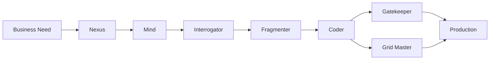

# Cyberpunk Context Runners — Agent System & CLI

A structured, composable agent system that turns business requirements into production‑ready software. The agents are stack‑agnostic and can be configured for any language or technology stack while maintaining consistent workflow and quality standards.

## Quick Start

### 1. Install the CLI

```bash
# Download the repository
curl -L https://github.com/Stivi7/cyberpunk-context-runners/archive/refs/heads/main.zip -o cyberpunk-context-runners.zip
unzip cyberpunk-context-runners.zip

cd cyberpunk-context-runners-main

# Install the cyberpunk command (single command setup)
echo "export PATH=\"$(pwd):\$PATH\"" >> ~/.zshrc && source ~/.zshrc

# Verify installation:
cyberpunk --version
```

### 2. Scaffold Your Project

```bash
# Navigate to your project directory
cd /path/to/your/project

# Initialize cyberpunk structure for your AI tool
cyberpunk init --claude    # For Claude Code
cyberpunk init --cursor    # For Cursor IDE
cyberpunk init --codex     # For OpenAI Codex

# Or create CYBERPUNK.md only for manual configuration
cyberpunk init
```

## AI Tool Support

The Cyberpunk Agent System supports multiple AI coding tools:

| AI Tool | Flag | Configuration Location | Documentation |
|---------|------|----------------------|---------------|
| **Claude Code** | `--claude` | `.claude/agents/*.md` | [Claude Code Docs](https://code.claude.com/docs/en/sub-agents) |
| **Cursor** | `--cursor` | `.cursor/agents/ + .cursor/skills/` | [Cursor Docs](https://docs.cursor.com/context/rules) |
| **OpenAI Codex** | `--codex` | `.codex/agents/ + .codex/skills/` | [Codex Docs](https://developers.openai.com/codex/overview) |

### Generated Structure

After running `cyberpunk init --<tool>`, your project will have:

```
your-project/
├── CYBERPUNK.md              # Core rules and agent system documentation
├── examples/                 # Usage examples
├── PRPs/                     # Product Requirement Prompts
├── plans/                    # Technical plans
├── tasks/                    # Task breakdowns
│
# Plus AI tool specific files:
├── .claude/agents/           # When using --claude
├── .claude/skills/
├── .cursor/agents/           # When using --cursor
├── .cursor/skills/
├── .cursor/rules/
└── .codex/                   # When using --codex
    ├── agents/
    ├── skills/
    └── config.toml
```

## CLI Usage

```bash
cyberpunk init [OPTIONS]
```

### Options
- `--claude`      Configure for Claude Code (creates `.claude/agents/` + `.claude/skills/`)
- `--cursor`      Configure for Cursor IDE (creates `.cursor/agents/` + `.cursor/skills/` + `.cursor/rules/`)
- `--codex`       Configure for OpenAI Codex (creates `.codex/agents/` + `.codex/skills/` + `.codex/config.toml`)
- `--dry-run`     Preview what will be created without making changes
- `--force`       Overwrite existing files without prompting
- `--help`        Show help message
- `--version`     Show version information

> **Note:** `--claude`, `--cursor`, and `--codex` are mutually exclusive. Use only one at a time.

### Examples

```bash
# Basic initialization (CYBERPUNK.md only)
cyberpunk init

# Configure for Claude Code
cyberpunk init --claude

# Configure for Cursor IDE with force overwrite
cyberpunk init --cursor --force

# Preview what will be created
cyberpunk init --codex --dry-run
```

## The Agent System

The cyberpunk agent system consists of 8 specialized agents that work together to transform business requirements into production-ready code:

### 🔄 **Core Workflow Agents**
- **The Operator** — Analyzes existing projects and generates customized examples and standards
- **The Nexus** — Creates Product Requirement Prompts (PRPs) from business needs
- **The Mind** — Designs technical architecture and phased implementation plans
- **The Interrogator** — Reviews and validates plans for completeness and risk
- **The Fragmenter** — Breaks plans into executable epics, stories, and tasks

### ⚙️ **Implementation Agents**
- **The Coder** — Implements code using functional programming principles
- **The Gatekeeper** — Reviews code quality and enforces standards
- **The Grid Master** — Manages infrastructure and deployment pipelines

### Agent Workflow


```mermaid
graph LR
    A[Business Need] --> B[Nexus]
    B --> C[Mind]
    C --> D[Interrogator]
    D --> E[Fragmenter]
    E --> F[Coder]
    F --> G[Gatekeeper]
    F --> H[Grid Master]
    G --> I[Production]
    H --> I
```

0. **Operator** → Project analysis → generates examples and standards
1. **Nexus** → Creates PRP → save to `PRPs/[feature].md`
2. **Mind** → Technical plan → save to `plans/[feature]-plan.md`
3. **Interrogator** → Validates plan → approves or requests changes
4. **Fragmenter** → Task breakdown → save to `tasks/[feature]/`
5. **Coder** → Implements code + tests
6. **Grid Master** → Infrastructure & deployment
7. **Gatekeeper** → Final review & approval

## Agent Invocation

After scaffolding with `cyberpunk init --<tool>`, use these commands in your AI editor:

### Quick Commands
- `operator: [scan/analyze project]` → Analyze project and generate standards
- `nexus: [requirements]` → Create Product Requirement Prompt
- `mind: [prp-file]` → Create technical plan from PRP
- `interrogator: [plan-file]` → Review and validate plan
- `fragmenter: [plan-file]` → Break plan into executable tasks
- `coder: [task]` → Implement feature with tests
- `grid-master: [infrastructure-task]` → Handle DevOps and infrastructure
- `gatekeeper: [code/files]` → Review code quality and approve

### Full Command Format
- **"Act as Operator"** → Read agent file → Analyze project and generate examples/standards
- **"Act as Nexus"** → Read agent file → Create Product Requirement Prompts
- **"Act as Mind"** → Read agent file → Generate technical plans and architecture
- **"Act as Interrogator"** → Read agent file → Review and validate plans
- **"Act as Fragmenter"** → Read agent file → Break plans into tasks
- **"Act as Coder"** → Read agent file → Implement features with functional patterns
- **"Act as Grid Master"** → Read agent file → Handle infrastructure and DevOps
- **"Act as Gatekeeper"** → Read agent file → Review code quality and approve

### Example Workflow

```
# Step 0: Analyze project (initial setup)
User: "operator: scan project and generate standards"
AI: [Becomes The Operator, analyzes project structure and creates examples]

# Step 1: Create requirements
User: "nexus: Build a real-time chat application with WebSocket support"
AI: [Becomes The Nexus, creates comprehensive PRP]

# Step 2: Design architecture  
User: "mind: PRPs/chat-app.md"
AI: [Becomes The Mind, creates technical architecture]

# Step 3: Review plan
User: "interrogator: plans/chat-app-plan.md"
AI: [Becomes The Interrogator, reviews plan and provides feedback]

# Step 4: Break into tasks
User: "fragmenter: plans/chat-app-plan.md"
AI: [Becomes The Fragmenter, creates detailed task breakdown]

# Step 5: Implement features
User: "coder: Implement WebSocket connection handler"
AI: [Becomes The Coder, writes functional TypeScript code and tests]

# Step 6: Infrastructure
User: "grid-master: Setup AWS infrastructure for chat app"
AI: [Becomes The Grid Master, creates CloudFormation templates]

# Step 7: Final review
User: "gatekeeper: Review the chat application code"
AI: [Becomes The Gatekeeper, performs quality review]
```

## CYBERPUNK.md

The `CYBERPUNK.md` file is the **central documentation** for the Cyberpunk Agent System. It contains:

- **Agent Commands** - How to invoke each agent
- **Agent Workflow Process** - The 8-step workflow
- **Agent Invocation Rules** - Best practices for working with agents
- **Quick Commands** - Shortcuts for common tasks
- **Quality Standards** - Code quality requirements
- **Core Principles** - Functional programming guidelines
- **AI Tool Integration** - How to use with different AI tools

### Using CYBERPUNK.md

1. **Automatic Setup**: When you run `cyberpunk init --<tool>`, the CLI automatically configures your AI tool
2. **Manual Setup**: Copy the content of `CYBERPUNK.md` to your AI tool's configuration:
   - **Claude Code**: Copy to `CLAUDE.md` or reference in `.claude/agents/`
   - **Cursor**: Copy to `.cursor/rules/cyberpunk.mdc`
   - **Codex**: Reference via `.codex/config.toml` fallback filenames
3. **Customization**: Edit `CYBERPUNK.md` to add project-specific rules

## Project-Specific Setup

After running `cyberpunk init --<tool>`, the agents are ready to use with their default configuration. For project-specific customization:

### Use The Operator (Recommended)
The system includes The Operator agent that can analyze your project and generate language-specific examples:

```
User: "operator: scan project and generate standards"
# or
User: "Act as Operator" → analyze current project structure and generate customized examples
```

This will:
- Detect your project's language and framework
- Generate relevant code examples in the `examples/` directory
- Customize agent references for your specific stack
- Set up appropriate testing and infrastructure patterns

### Manual Customization
You can also manually edit the agent files to:
- Update technology references (e.g., specify React instead of generic frontend)
- Add project-specific quality standards
- Include custom infrastructure patterns
- Reference your preferred testing frameworks

## AI Tool Specific Configuration

### Claude Code
When using `--claude`, the CLI creates:
- `.claude/agents/` directory with agent files in YAML frontmatter format
- `.claude/skills/` directory with skill references
- `CLAUDE.md` - Appended with CYBERPUNK.md content

Each agent file includes:
```yaml
---
name: AgentName
description: What this agent does
model: sonnet
tools:
  - read
  - edit
---
```

### Cursor IDE
When using `--cursor`, the CLI creates:
- `.cursor/agents/` - Agent files in `.mdc` format
- `.cursor/skills/` - Skill references used by agents
- `.cursor/rules/cyberpunk.mdc` - Rules file with YAML frontmatter
- `CYBERPUNK.md` - For reference

### OpenAI Codex
When using `--codex`, the CLI creates:
- `.codex/agents/` - Agent files with Codex-friendly skill references
- `.codex/skills/` - Codex skills generated from templates
- `.codex/config.toml` - TOML configuration with project doc fallbacks
- `CYBERPUNK.md` - Used as project instructions via config fallback

## Core Principles

All agents follow these functional programming principles:

### 📝 **Code Quality**
- Pure functions and explicit data flow
- Immutability by default
- Function composition over inheritance
- Result/Either types instead of exceptions
- Strong typing where available

### 🔍 **Quality Standards**
- Lint, format, and build gates must pass
- Security scanning in CI/CD
- Test coverage ≥ 95%
- Property-based testing where applicable
- The Gatekeeper enforces these standards

### 📋 **File Organization**
```
project/
├── CYBERPUNK.md                     # Core agent system documentation
├── PRPs/[feature-name].md           # Product requirements
├── plans/[feature-name]-plan.md     # Technical plans
├── tasks/[feature-name]/            # Task breakdowns
├── examples/                        # Examples and references
│
├── .claude/agents/                  # Agent definitions (Claude)
├── .claude/skills/
├── .cursor/agents/                  # Agent definitions (Cursor)
├── .cursor/skills/
├── .codex/agents/                   # Agent definitions (Codex)
└── .codex/skills/
```

## Troubleshooting

### Common Issues

**"Templates directory not found"**
- Ensure you're running the script from the cyberpunk-context-runners directory
- Or use the full path: `/path/to/cyberpunk-context-runners/cyberpunk init`

**"Permission denied"**
- Make sure the script is executable: `chmod +x cyberpunk`
- Or run with bash: `bash cyberpunk init`

**"Command not found"**
- Check that the directory is in your PATH: `echo $PATH`
- Try using the full path to the script
- Restart your terminal after modifying PATH

**"Mutually exclusive flags error"**
- Only use one of `--claude`, `--cursor`, or `--codex` at a time
- Run the command multiple times with different flags if needed

## Migration from v0.1.0

If you're upgrading from v0.1.0:

1. Cursor configuration now uses `.cursor/rules/cyberpunk.mdc`
2. Codex configuration now includes `.codex/skills/` generated from templates
3. `CYBERPUNK.md` is the central documentation file
4. Run `cyberpunk init --<tool> --force` to update your configuration

## Contributing

When adding or modifying agents:
1. Maintain the cyberpunk naming/theme
2. Keep structured inputs/outputs in each agent file
3. Include validation criteria and interaction patterns
4. Provide example usage or references
5. Preserve functional programming principles
6. Update templates and test the CLI
7. Support all three AI tool formats (Claude, Cursor, Codex)

## License

See [LICENSE](LICENSE) for details.

---

**Ready to build the future? 🤖✨**

`cyberpunk init --<tool>` and let the agents guide your development journey.
